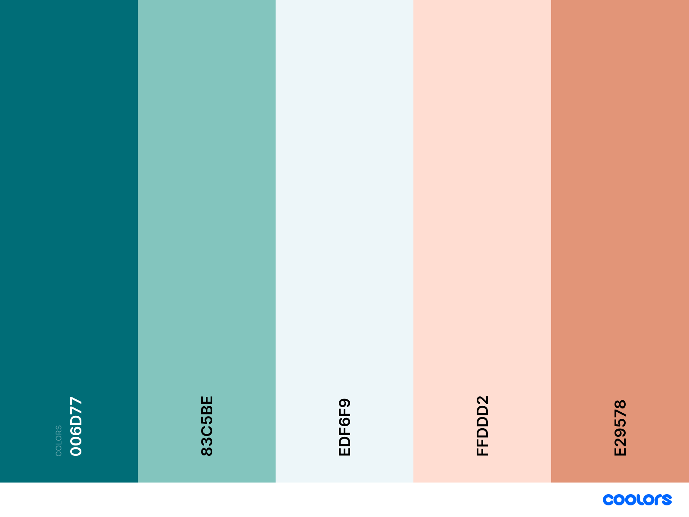

# Los Gochos Restaurant

[Link to live page](https://jorgekleiss.github.io/los-gochos-restaurant/)

Los Gochos Restaurant is a small family owned restaurant, owned and ran by a Venezuelan couple from Merida-Venezuela. We pride in having a fun and enjoyable environment when people can meet up for great food, a few drinks or just a place to relax with friend and enjoy Latino America music. 

Image of website of various devices

# Table of Contents
* [User experience (UX)](#user-experience--ux-)
    + [User Goals](#user-goals)
      - [First time visitor Goals](#first-time-visitor-goals)
      - [Returning visitor Goals](#returning-visitor-goals)
      - [Frequent user Goals](#frequent-user-goals)
    + [Site owner Goals](#site-owner-goals)
    + [Requirements and expectations](#requirements-and-expectations)
      - [Requirements](#requirements)
      - [expectations](#expectations)
    + [Design](#design)
      - [Colour scheme](#colour-scheme)
      - [Typography](#typography)
      - [Imagery](#imagery)
    + [Wireframes](#wireframes)
    + [Features](#features)
    + [Technologies used](#technologies-used)
      - [Languages used](#languages-used)
      -  [Tools, Frameworks, Libraries and Programs used.](#tools-frameworks-libraries-and-programs-used)
    + [Testing](#testing)
      - [Known bugs](#known-bugs)
  * [Deployment](#deployment)
    + [Acknowledgements](#acknowledgements)

# User experience (UX)

# User Goals
#### First time visitor Goals
1.	As a first-time visitor, I want to feel welcome to the restaurant without having been there yet.
2.	As a first-time visitor, I want to be able to find all basic information from the restaurant easily. 
3.	As a first-time visitor, I want to be able to find directions to the restaurant and clear contact info. 
4.	As a first-time visitor, I want to have access to an easy to understand menu that clearly shows any ingredients that can be allergens to some people.

#### Returning visitor Goals
1.	As a returning visitor, I want to have various ways to contact the restaurant for any queries or booking I may have.
2.	As a returning visitor, I want to find out about deals or new features they may have.
3.	As a returning visitor, I want to be able to look at testimonials of previous customers to find out what their experience was.

#### Frequent user Goals
1.	As a frequent user, I want to be able to sign up to a newsletter and receive regular updates and possible new additions to the menu. 
2.	As a frequent user, I want to be able to follow the restaurants special media and see what they are up to.
3.	As a frequent user, I want to know about events taking place.
4.	As a frequent user, I want to be able to sign up to some sort of rewards club
# Site owner Goals
- Provide information for the customer to not just feel safe about their visit, but also to know more about us, our menu and our country before they arrive to the restaurant.
- Let customers know about Deals or specials there may be on.
- Provide an easy way to comunicate to with restaurant staff.
- Direct as manu people as possible to out social media pages, and promote our experience.
- Increase the amount of viitors to the site. 

### Requirements and expectations
#### Requirements
- The site must be easy to understand and navigate.
- The information displayed must be easy to read and understand.
- The pictures used will be just like the food served on the restaurant.

#### Expectations
- We expect the links of social media and to the different sections of the site to work.
- Once a message has been sent, we expect the correct information to be added to the form in orther to contact the customer back. 
- We expect the site to be visible in various screen sizes and adjust to them acordinly. 

[Back to top](#table-of-contents)

# Design 
#### Colour scheme
 
#### Typography 
- Architects Daughter was used for the main headings and titles.
- Playfair Display was used for the body of the page.
#### Imagery 
- Trip Advisor Image from "Free Vector Silhouette - Logo Tripadvisor Eps Clipart@pikpng.com".
- Standard restaurant images downloaded from the free library by [rawpixel.com](http://www.rawpixel.com).
- Venezuelan food related pictures downloaded from free trial subcription of [Shutterstock](https://www.shutterstock.com/home).
- One of the images, also from the free library was made by Karolina / Kaboompics for rawpixel.com.
- Colour palette from [Coolors](http://www.coolors.co).
### Wireframes 
- [Home page on a Mobilo Phone](wireframes/restaurnt-phone.png)
- [Home page on a tablet](wireframes/restaurant-tablet.png)
- [Home page on a Desktop](wireframes/restaurant-dektop.png)

# Features
-	 Responsive site across a variety of devices.
-  Interactive elements 
-	 Accessibility 

## Technologies used

###	Languages
-	HTML
-	CSS

### Tools, Frameworks, libraries and programs.  

-	[Bootstrap](https://getbootstrap.com/docs/5.1/getting-started/introduction/)
-	[Google Fonts](https://fonts.google.com/)
-	[Font Awesome](https://fontawesome.com/)
-	[GitHub](https://github.com/)
-	[Balsamiq](https://balsamiq.com/wireframes/)
- [Markdown-toc](http://ecotrust-canada.github.io/markdown-toc/)
- [W3C HTML Validation Service:]( https://validator.w3.org/)
- [W3C CSS Validation Service:](https://jigsaw.w3.org/css-validator/) 
- [Coolors](https://coolors.co/)
-	Hover.css
- Git

[Back to top](#table-of-contents)

# Testing

ELABORATE MORE ON MY EXPERIENCE TESTING THE SITE

-	This Website was tested on Safari, Brave, Google Chrome, Internet Explorer.
-	The website was viewed on a variety of devices such as Desktop, Laptop, iPad PRO, iPhone 12 & iPhone12 PRO.
-	A lot of testing was done to ensure that all of the links in the pages worked correctly.
-	Friends and family members were asked to review the site and documentation to point out any bugs and/or user experience issues. This was done in various countries across different languages. 

- HTML Validator [Results](ADD LINKS WHEN AVAILABLE)

- CSS Validator [Results](ADD LINKS WHEN AVAILABLE)

#### Known bugs

# Deployment
Following writing the code then commiting and pushing to GitHub, this project was deployed using GitHub by the following steps.

1. Navigate to the repository on github and click 'Settings'.
2. Then select 'Pages' on the side navigation.
3. Select the 'None' dropdown, and then click 'master'.
4. Click on the 'Save' button.
5. Now the website is now live on https://jorgekleiss.github.io/los-gochos-restaurant/
- If any changes are required, they can be done, commited and pushed to GitHub and the changes will be updated.

[Back to top](#table-of-contents)

#	Acknowledgements 
-	To my Mentor for his continuous support and extremely helpful feedback.
-	To the Tutor support at Code Institute for their invaluable support.
-	To my wife for her brilliant ideas and input in to this project.
-	To my friends and family for taking the time to explore the website and provide feedback about their experience. 

[Back to top](#table-of-contents)

