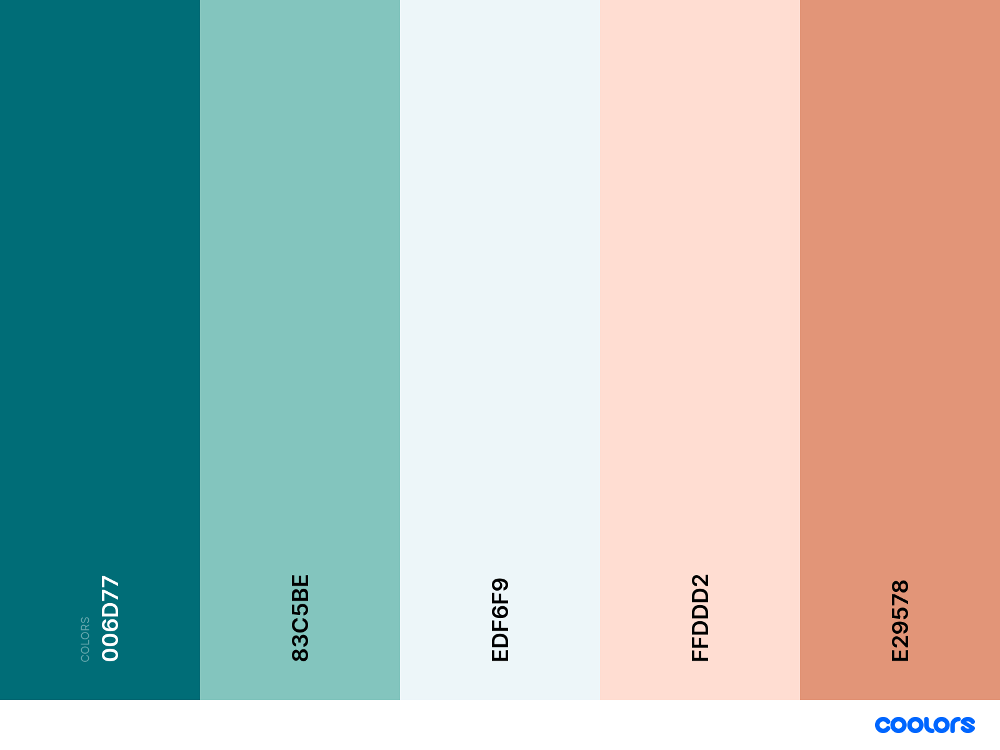

# Los Gochos Restaurant

Link to live page

Los Gochos Restaurant is a small family owned restaurant, owned and ran by a Venezuelan couple from Merida-Venezuela. We pride in having a fun and enjoyable environment when people can meet up for great food, a few drinks or just a place to relax with friend and enjoy Latino America music. 

Image of website of various devices

## User experience (UX)

### User stories
#### First time visitor goals
1.	As a first-time visitor, I want to feel welcome to the restaurant without having been there yet.
2.	As a first-time visitor, I want to be able to find all basic information from the restaurant easily. 
3.	As a first-time visitor, I want to be able to find directions to the restaurant and clear contact info. 
4.	As a first-time visitor, I want to have access to an easy to understand menu that clearly shows any ingredients that can be allergens to some people.
#### Returning visitor goals
1.	As a returning visitor, I want to have various ways to contact the restaurant for any queries or booking I may have.
2.	As a returning visitor, I want to find out about deals or new features they may have.
3.	As a returning visitor, I want to be able to look at testimonials of previous customers to find out what their experience was.

#### Frequent user goals
1.	As a frequent user, I want to be able to sign up to a newsletter and receive regular updates and possible new additions to the menu. 
2.	As a frequent user, I want to be able to follow the restaurants special media and see what they are up to.
3.	As a frequent user, I want to know about events taking place.
4.	As a frequent user, I want to be able to sign up to some sort of rewards club
### Design 
#### Colour scheme
 
#### Typography 
•	 
#### Imagery 
- Trip Advisor Image from "Free Vector Silhouette - Logo Tripadvisor Eps Clipart@pikpng.com".
- Standard restaurant images downloaded from the free library by [rawpixel.com](http://www.rawpixel.com).
- Venezuelan food related pictures downloaded from free trial subcription of [Shutterstock](https://www.shutterstock.com/home).
- One of the images, also from the free library was made by Karolina / Kaboompics for rawpixel.com.
- Colour palette from [Coolors](http://www.coolors.co).
#### Wireframes (ADD LINKS TO WIRE FRAMES)
- [Home page on a Mobilo Phone](wireframes/restaurnt-phone.png)
- [Home page on a tablet](wireframes/restaurant-tablet.png)
- [Home page on a Desktop](wireframes/restaurant-dektop.png)

#### Features
•	 Responsive site across a variety of devices.
•	 Interactive elements 
•	 Accessibility 

#### Technologies used

•	Languages used
o	HTML5
o	CSS3

### Frameworks, libraries and programs used.  (ADD LINKS TO ALL ITEMS) 
-	[Bootstrap 5.1.3](https://getbootstrap.com/docs/5.1/getting-started/introduction/):
Bootstrap was used to assist with the responsiveness and styling of the website.
-	Hover.css:
Hover.css was used on the Navbar, gallery and Social Media icons in the footer to add responsivness to the links.
-	[Google Fonts](https://fonts.google.com/):
Google fonts were used to import the 'Titillium Web' font into the style.css file which is used on all pages throughout the project.
-	[Font Awesome](https://fontawesome.com/):
Font Awesome was used on all pages throughout the website to add icons for aesthetic and UX purposes.
-	[jQuery]():
jQuery came with Bootstrap to make the navbar responsive but was also used for the smooth scroll function in JavaScript.
-	[Git]()
Git was used for version control by utilizing the Gitpod terminal to commit to Git and Push to GitHub.
-	[GitHub](https://github.com/):
GitHub is used to store the projects code after being pushed from Git.
-	[Balsamiq](https://balsamiq.com/wireframes/):
Balsamiq was used to create the wireframes during the design process.

### Testing

Testing used stories from user experience section

### Further testing
-	This Website was tested on Safari, Brave, Google Chrome, Internet Explorer.
-	The website was viewed on a variety of devices such as Desktop, Laptop, iPad PRO, iPhone 12 & iPhone12 PRO.
-	A lot of testing was done to ensure that all of the links in the pages worked correctly.
-	Friends and family members were asked to review the site and documentation to point out any bugs and/or user experience issues. This was done in various countries across different languages. 

### Known bugs

## Deployment
###	GitHub pages
###	Forking the GitHub Repository
###	Making a local Clone

## Credits

###	Code
-	 [Bootstrap5](https://getbootstrap.com/docs/5.1/getting-started/introduction/): Bootstrap Library used throughout the project.
-	
-	  
###	Content 
-	 All content written by developer.

###	Acknowledgements 
-	To my Mentor for his continuous support and extremely helpful feedback.
-	To the Tutor support at Code Institute for their invaluable support.
-	To my wife for her brilliant ideas and input in to this project.
-	To my friends and family for taking the time to explore the website and provide feedback about their experience. 

